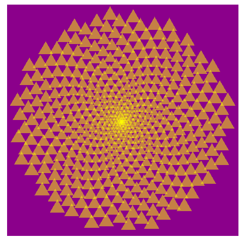

# Phyllotaxis: Draw flowers using mathematics with R
                                                                                                 
   

## Project Description

This is my solution to the project from [DataCamp](https://www.datacamp.com).

The goal is to use R and mathematics for the arrangement of leaves on an axis or stem, otherwise known as phyllotaxis.

We will make plots using `ggplot2`.
